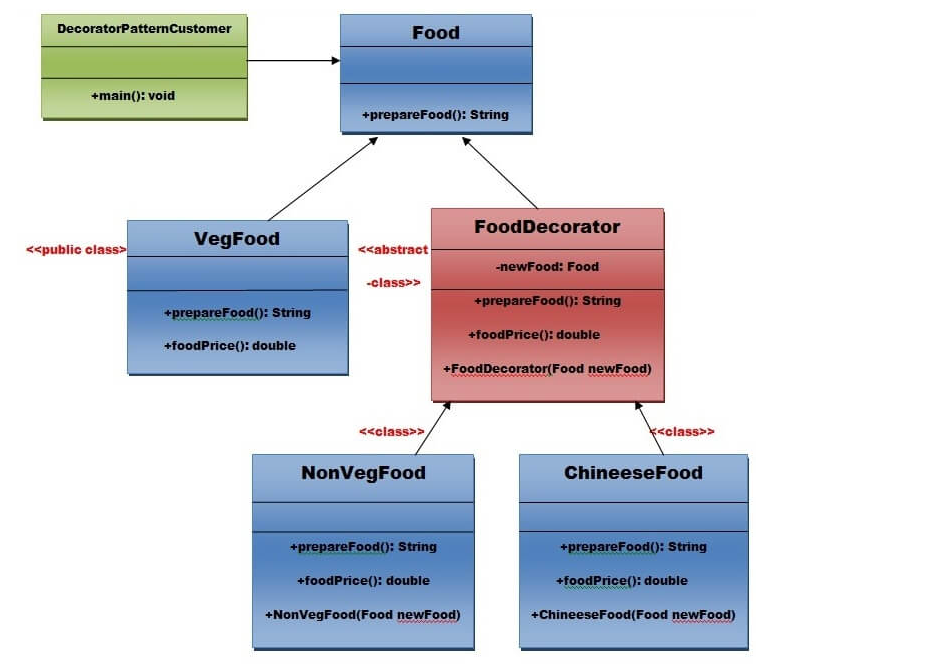

# Decorator Pattern

The Decorator Pattern uses composition instead of inheritance to extend the functionality of an object at runtime.

The Decorator Pattern is also known as Wrapper.

## Advantage of Decorator Pattern:

- It provides greater flexibility than static inheritance.
- It enhances the extensibility of the object, because changes are made by coding new classes.
- It simplifies the coding by allowing you to develop a series of functionality from targeted classes instead of coding all of the behavior into the object.

## Usage of Decorator Pattern

- When you want to transparently and dynamically add responsibilities to objects without affecting other objects.
- When you want to add responsibilities to an object that you may want to change in future.
- Extending functionality by sub-classing is no longer practical.

### UML for Decorator Pattern
